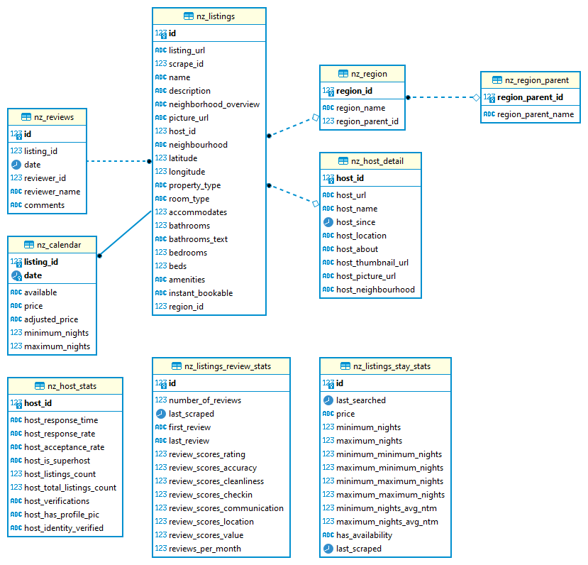

# INFO 408 Assignment 2 Project

### MUST READ FIRST

<mark><span style="color:red">**Note**: all source codes are saved at GitHub
Repository [INFO408_PROJECT](https://github.com/ChrisYangS/INFO408_PROJECT). To
review source code or following instructions to run the ETL process, you need to
clone this repository to your local machine</span></mark>.

This document offers an overview of the New Zealand Airbnb data migration
project, providing essential technical guidance on the following aspects:

1. **Running the Data Migration Application**: Detailed instructions on how to
   execute the data migration application successfully.

2. **New Database Structure**: An explanation of the structure of the new
   database, outlining its components and organization.

3. **Original Dataset Structures vs. New Database Tables**: A comparison between
   the structures of the original datasets sourced from
   [Inside Airbnb](http://insideairbnb.com/new-zealand/) and the corresponding
   tables within the new database.

Please note that this project is a simulated exercise, and all raw data utilized
in this migration have been downloaded from the specified source.

# Table of Contents

-   [INFO 408 Assignment 2 Project](#info-408-assignment-2-project)
    -   [MUST READ FIRST](#must-read-first)
-   [Table of Contents](#table-of-contents)
-   [Description](#description)
-   [Getting Started](#getting-started)
    -   [Dependencies](#dependencies)
    -   [Installing](#installing)
    -   [Installation Instructions](#installation-instructions)
    -   [Executing program](#executing-program)
-   [Source Data](#source-data)
-   [Why Use PostgreSQL for this project:](#why-use-postgresql-for-this-project)
-   [Destination Database Table Structure](#destination-database-table-structure)
-   [New Zealand Airbnb Data Tables](#new-zealand-airbnb-data-tables)
    -   [Table Schemas](#table-schemas)
        -   [nz_host_detail](#nz_host_detail)
        -   [nz_host_stats](#nz_host_stats)
        -   [nz_listings_review_stats](#nz_listings_review_stats)
        -   [nz_listings_stay_stats](#nz_listings_stay_stats)
        -   [nz_region_parent](#nz_region_parent)
        -   [nz_region](#nz_region)
        -   [nz_listings](#nz_listings)
        -   [nz_reviews](#nz_reviews)
        -   [nz_calendar](#nz_calendar)
    -   [Reasons for Table Designs](#reasons-for-table-designs)
    -   [Relationships Among Tables](#relationships-among-tables)
-   [Database SQL Functions and Stored Procedures](#database-sql-functions-and-stored-procedures)
    -   [1. Procedure: `cancel_booking`](#1-procedure-cancel_booking)
        -   [Purpose:](#purpose)
        -   [Parameters:](#parameters)
    -   [2. Function: `check_availability`](#2-function-check_availability)
        -   [Purpose:](#purpose-1)
        -   [Parameters:](#parameters-1)
    -   [3. Procedure: `made_booking`](#3-procedure-made_booking)
        -   [Purpose:](#purpose-2)
        -   [Parameters:](#parameters-2)
    -   [4. Procedure: `reset_database`](#4-procedure-reset_database)
        -   [Purpose:](#purpose-3)
    -   [5. Procedure: `update_price_and_availability`](#5-procedure-update_price_and_availability)
        -   [Purpose:](#purpose-4)
    -   [6. Procedure: `update_stay_stats`](#6-procedure-update_stay_stats)
        -   [Purpose:](#purpose-5)
    -   [7. create_tables.sql sql file](#7-create_tablessql-sql-file)
-   [Special Thanks](#special-thanks)
-   [Authors](#authors)
-   [Version History](#version-history)

# Description

Project Summary: Airbnb Data Migration and Database Restructuring

Airbnb is embarking on a significant data migration project, transitioning from
its old system to a new one. The initial phase of this project focuses on
migrating data from New Zealand, serving as a crucial testbed before expanding
to other regions. This migration involves the extraction and transformation of
data from the old system into the new system's highly normalized database
structure. Here are the key aspects of this project:

1. **Data Extraction and Sources**:

    - The old system contains a wealth of data, which is divided into three main
      spreadsheets:
      [listings.csv](http://data.insideairbnb.com/new-zealand/2023-09-02/data/listings.csv.gz),
      [calendar.csv](http://data.insideairbnb.com/new-zealand/2023-09-02/data/calendar.csv.gz),
      and
      [reviews.csv](http://data.insideairbnb.com/new-zealand/2023-09-02/data/reviews.csv.gz).
    - [listings.csv](http://data.insideairbnb.com/new-zealand/2023-09-02/data/listings.csv.gz)
      encompasses comprehensive information about Airbnb listings. This includes
      property details, host information, availability, and various statistical
      data related to each listing, such as pricing, stay dates, and review
      ratings.

2. **Data Migration Process**:

    - The migration process involves extracting data from these spreadsheets and
      transforming it to fit the new system's normalized database structure.
    - The normalization process entails breaking down the primary dataset
      (listing information) into multiple subsets, ensuring data integrity and
      efficient query performance in the new system.

3. **Business Intelligence Functionality**:

    - The new system is equipped with robust Business Intelligence (BI)
      capabilities, serving both analysts and customers.
    - Users can query aggregated data at various levels for each listing
      property from the moment it was listed on Airbnb.
    - This BI functionality empowers users to gain insights into property
      performance, pricing trends, availability patterns, and customer reviews.

4. **Data Update Mechanism**:
    - To keep the aggregated data up to date, the database system incorporates a
      dynamic update mechanism.
    - When users or customers perform queries through the BI interface, the
      system recalculates and updates the aggregated data in real-time, ensuring
      that the insights provided are current and accurate.

In addition to the key aspects of the data migration project described, there
are specific requirements for the new system, considering high-efficiency data
analytics, data normalization to avoid data duplications, and high performance
on both read and write data operations. These requirements are essential for the
success of the project:

1. **High-Efficiency Data Analytics, Especially for Performing Aggregations**:

    - The new system should be optimized for data analytics tasks, especially
      when performing aggregations on large datasets.
    - It should support efficient grouping, filtering, and summarization of data
      to enable complex analytical queries.
    - Utilizing features like indexing, query optimization, and parallel
      processing can significantly enhance data analytics performance.

2. **Data Normalization to Avoid Data Duplications**:

    - Data normalization is a key requirement to ensure efficient data storage
      and integrity.
    - Redundant data should be minimized or eliminated through proper table
      design, relationships, and normalization techniques.
    - Normalized data structures enhance data consistency, reduce storage costs,
      and simplify data maintenance.

3. **High Performance on Read and Write Data Operations**:

    - The new system should be capable of handling high volumes of both read and
      write operations efficiently.
    - Write operations, such as data ingestion and updates, should be optimized
      to minimize latency and ensure real-time data availability.
    - Read operations, including data retrieval and analytics queries, should be
      executed with minimal response times to support timely decision-making.
    - Caching mechanisms, partitioning strategies, and load balancing can
      contribute to achieving high-performance data access.

4. **Scalability and Elasticity**:

    - The system should be designed to scale horizontally and vertically to
      accommodate growing data volumes and increasing user loads.
    - Elasticity features, such as automatic resource provisioning and scaling,
      can ensure optimal performance during peak usage periods.

5. **Data Quality and Integrity**:

    - Data quality checks and validation processes should be integrated into
      data pipelines to maintain data integrity.
    - Implementing data quality rules and constraints can help prevent
      inaccurate or incomplete data from being stored in the database.

6. **Security and Access Control**:

    - Robust security measures, including authentication, authorization, and
      encryption, should be in place to protect sensitive data.
    - Access control mechanisms should be enforced to restrict unauthorized
      access to data.

7. **Monitoring and Optimization**:

    - Continuous monitoring of system performance and resource utilization is
      essential to identify bottlenecks and optimize query execution.
    - Proactive performance tuning, database maintenance, and regular backups
      should be part of system operations.

8. **Documentation and Training**:
    - Comprehensive documentation of the database schema, data dictionary, and
      query optimization techniques should be available for system
      administrators and data analysts.
    - Training programs should be provided to ensure that the team can
      effectively use the system for analytics and reporting.

This project is essential for Airbnb to modernize its data infrastructure,
ensuring that data from the old system is seamlessly integrated into the new
highly normalized database structure. The phased approach, starting with New
Zealand data, allows for thorough testing and validation before rolling out the
migration to other regions. Moreover, the incorporation of BI capabilities and
real-time data updates positions Airbnb to better serve its analysts and
customers with valuable insights into property performance and customer reviews.
Overall, this project represents a critical step in Airbnb's data management and
analytics capabilities.

[BACK TO Table of Contents](#table-of-contents)

# Getting Started

## Dependencies

To successfully run this application, please ensure the following prerequisites
are met:

1. **Operating System Compatibility**:

    - This application is compatible with Windows, MacOS, and Linux systems.
    - Python environment should be installed on your system.

2. **Required Python Packages**:

    - Ensure that all the necessary Python packages are installed. Refer to the
      [requirements.txt](./requirements.txt) file for a comprehensive list.

3. **Network Environment**:

    - To access and run this application, you must either be within the Otago
      University network environment or connect to the network via VPN for
      remote access.

4. **SQL Access and Permissions**:

    - You should have both read and write SQL access to the database `info408`
      hosted by `isdb.uod.otago.ac.nz`.
    - Additionally, you need permissions to execute stored procedures within the
      database.

5. **Dataset Downloads**:
    - Download the following datasets and extract them:
        - [listings.csv.gz](http://data.insideairbnb.com/new-zealand/2023-09-02/data/listings.csv.gz)
        - [calendar.csv.gz](http://data.insideairbnb.com/new-zealand/2023-09-02/data/calendar.csv.gz)
        - [reviews.csv.gz](http://data.insideairbnb.com/new-zealand/2023-09-02/data/reviews.csv.gz)
    - Save these extracted files in the [/data](./data/) folder.

Meeting these dependencies is essential for the successful execution of the
application, ensuring that it can access the required data sources and the
database while operating seamlessly on your specific operating system with the
necessary Python packages installed.

## Installing

## Installation Instructions

Follow these steps to set up and run the data extraction application:

1. **Clone or Download the Repository**:

    - Clone or download the required dependencies from
      [INFO408_PROJECT](https://github.com/ChrisYangS/INFO408_PROJECT) on GitHub
      to your local machine.

2. **Download and Extract Datasets**:

    - Download the following datasets and extract them:
        - [listings.csv.gz](http://data.insideairbnb.com/new-zealand/2023-09-02/data/listings.csv.gz)
        - [calendar.csv.gz](http://data.insideairbnb.com/new-zealand/2023-09-02/data/calendar.csv.gz)
        - [reviews.csv.gz](http://data.insideairbnb.com/new-zealand/2023-09-02/data/reviews.csv.gz)
    - Save these extracted files in the `/data` folder within the project
      directory.

3. **Install Required Python Packages**:

    - Navigate to the application's root directory using the terminal.
    - Run the following command to install all the necessary Python packages:
        ```
        pip install -r requirements.txt
        ```

4. **Configure `config.py`**:

    - Create a `config.py` Python file in the project's root directory.
    - Open the `config.py` file using a text editor.
    - Inside the file, provide the following information:
        ```python
        username = "username"  # need your own info408 database user name
        password = "password"  # need your own info408 database password
        ```
        Replace `"username"` with your username and `"password"` with your
        password for authentication.

5. **Run the Data Extraction Application**:
    - Launch Jupyter Notebook.
    - Open the `data_loader.ipynb` Jupyter Notebook file from the project's root
      directory.
    - Execute the notebook to begin the data extraction process.

Following these steps will enable you to set up the data extraction application,
ensuring that it can access the required datasets, install necessary Python
packages, and authenticate your credentials. You can then execute the data
extraction process by running the provided Jupyter Notebook.

## Executing program

To execute the program, follow these steps:

1.  **Open Terminal**:

    -   Navigate to the root directory of the project using your terminal or
        command prompt. This is the directory where you have cloned or
        downloaded the project from GitHub.

2.  **Activate Virtual Environment (if used)** (Optional but recommended):

    -   If you're working within a virtual environment (a recommended practice),
        activate it by running the appropriate command based on your operating
        system:
        -   On Windows:
            ```
            venv\Scripts\activate
            ```
        -   On macOS and Linux:
            ```
            source venv/bin/activate
            ```
    -   Activating the virtual environment isolates the project's dependencies,
        ensuring they don't conflict with other Python packages on your system.

3.  **Open the [data_loader.ipynb](./data_loader.ipynb) Jupyter notebook to run
    the Program**:

    -   Open Jupyter Notebook by running:
        ```
        jupyter notebook
        ```
    -   In the Jupyter interface, navigate to the `data_loader.ipynb` notebook
        and execute all the cells from the top to run the data extraction
        process completely.

4.  **Follow On-Screen Instructions**:
    -   When running the Jupyter Notebook, the cells will execute from top to
        bottom. If there are no errors, the process will continue smoothly.
    -   In case an error occurs during execution, the process will halt, and an
        error message will be displayed. You will need to diagnose the error,
        make necessary corrections to the code, and then continue running the
        notebook until completion.
    -   If you wish to skip a specific function or section, you can do so
        selectively if you are familiar with the notebook's structure to avoid
        encountering errors. However, exercise caution when skipping portions of
        the notebook to ensure data integrity and consistency.
5.  **Monitor Progress**:

    -   Keep an eye on the terminal or Jupyter Notebook interface for any
        output, progress updates, or potential errors during program execution.

6.  **Complete Execution**:
    -   Allow the program to finish its execution. The time required for
        completion depends on the complexity of the task and the volume of data
        being processed.
    -   It's important to note that for this data extraction process, the
        execution time may be approximately 20 minutes when connected to the
        database via VPN. While the performance on the university network is not
        tested, it might offer faster execution times.

By following these steps, you will be able to run the program successfully and
execute the specified functionality, whether it's data extraction, analysis, or
any other task associated with the program.

[BACK TO Table of Contents](#table-of-contents)

# Source Data

In this project, we utilize several CSV source data files, each providing
distinct and valuable information. The largest dataset - **not means by volume
of data, but data complexity with many data fields** is
[listings.csv.gz](http://data.insideairbnb.com/new-zealand/2023-09-02/data/listings.csv.gz).
This dataset has following type of information all blended together into one
wide table:

1. **Listing Property Information**:

    - This section encompasses a wide range of data about the listing
      properties, including:
        - Property descriptions
        - Property images
        - The number of bedrooms, bathrooms, and beds
        - Regional details related to each listing
        - Host information, such as host names, hosting tenure, basic details,
          and host locations
        - Various statistical data, such as:
            - Last search timestamps
            - Pricing information
            - Minimum and maximum nights for bookings
            - Minimum and maximum values for minimum nights
            - Minimum and maximum values for maximum nights
            - Average minimum nights
            - Average maximum nights

2. **Host Information**:

    - This category provides key metrics and details about property hosts,
      including:
        - Host response time
        - Host response rate
        - Host acceptance rate
        - Host superhost status
        - Host listings count
        - Host total listings count

3. **Listing Review Information**: - This section contains comprehensive data
   related to guest reviews for each listing property. It includes information
   such as: - The number of reviews received - Timestamps for the last scrape,
   first review, and last review - Review scores for various aspects of the
   listing, including accuracy, cleanliness, check-in, communication, location,
   and overall rating.

In order to achieve data normalisation to meet the new database requirements and
avoid data duplications, this dataset has been split mutiple based on each
unique data features as discussed above.

Please note that
[calendar.csv.gz](http://data.insideairbnb.com/new-zealand/2023-09-02/data/calendar.csv.gz)
and
[reviews.csv.gz](http://data.insideairbnb.com/new-zealand/2023-09-02/data/reviews.csv.gz)
require minimal data structure manipulation, as they primarily serve as records
of availability and reviews. In contrast,
**_[listings.csv.gz](http://data.insideairbnb.com/new-zealand/2023-09-02/data/listings.csv.gz)
is a comprehensive dataset that provides a wealth of information related to
listing properties and hosts, making it a central focus of this project._**

[BACK TO Table of Contents](#table-of-contents)

# Why Use PostgreSQL for this project:

The destination database will be PostgreSQL, which we have following strong
reasons to support using this SQL database in this project.

1. **Data Integration**: PostgreSQL can integrate with ETL (Extract, Transform,
   Load) tools to facilitate data integration from various sources into a
   centralized data warehouse for BI purposes.
2. **Data Complexity**: The dataset you're working with, particularly the
   `listings.csv.gz`, contains a wide range of data fields with complex
   relationships. PostgreSQL is well-suited for handling complex data structures
   and relationships, making it an ideal choice for normalizing and structuring
   this data.

3. **Data Normalization**: As mentioned, the goal is to achieve data
   normalization to meet new database requirements and avoid data duplications.
   PostgreSQL supports the normalization process by allowing you to define
   relationships between tables and enforce data integrity constraints.

4. **Structured Query Language (SQL)**: PostgreSQL is a powerful relational
   database management system that uses SQL. SQL is highly effective for
   querying, aggregating, and transforming data, which is essential for data
   analysis and reporting tasks.

5. **Scalability**: PostgreSQL can handle large datasets and is scalable,
   allowing you to work with both small and large volumes of data effectively.
   It's suitable for projects that may require future scaling.

6. **Flexibility**: PostgreSQL offers support for various data types, including
   text, numeric, date/time, and JSON, among others. This flexibility allows
   users to store and work with diverse types of data within the same database.

7. **Indexes**: PostgreSQL allows users to create indexes on columns, improving
   query performance, especially when dealing with large datasets.

8. **ACID Compliance**: PostgreSQL is ACID (Atomicity, Consistency, Isolation,
   Durability)-compliant, ensuring data integrity and reliability.

9. **Advanced Analytics and Data Warehouse**: PostgreSQL provides support for
   advanced analytics through extensions like PostGIS for spatial analysis and
   pg_stat_statements for monitoring and optimizing query performance. MOst
   importantly, PostgreSQL can be used as a data warehousing solution, where you
   can store and manage historical data for BI analysis.

Considering the complexity of your data and the need for data normalization,
PostgreSQL is a robust choice that will enable you to efficiently manage and
analyze your dataset while adhering to best practices in database design and
normalization.

[BACK TO Table of Contents](#table-of-contents)

# Destination Database Table Structure

The database comprises several tables, each designed to store specific
categories of data related to Airbnb listings, hosts, reviews, and other
relevant details. `nz_host_detail`, `nz_region_parent `,`nz_listings `,
`nz_reviews` and `nz_calendar ` tables are the main systems tables and they are
created under normalized relationship.

`nz_host_stats`,`nz_listings_review_stats` and `nz_listings_stay_stats` are
analytical tables which the do not have any relationship to each other or other
system tables, and they are update either periodically or manually updated by
system administrators or users.

Below is the graph showing table relations:



This database is meticulously structured to store a wide range of data related
to Airbnb listings, hosts, reviews, and geographical regions. Below, we provide
a comprehensive overview of the tables, their attributes, and the relationships
that connect them:

[BACK TO Table of Contents](#table-of-contents)

# New Zealand Airbnb Data Tables

This document provides an overview of the database schema for an Airbnb-like
platform in New Zealand. The schema includes multiple tables designed to store
various aspects of property listings, host information, reviews, and stay
statistics. Below, we detail the table schemas, the reasons behind their
designs, and the relationships among these tables.

## Table Schemas

### nz_host_detail

-   _host_id (int8 NOT NULL):_ Unique identifier for hosts.
-   _host_url (text NULL):_ URL associated with the host.
-   _host_name (text NULL):_ Name of the host.
-   _host_since (date NULL):_ Date when the host joined.
-   _host_location (text NULL):_ Location of the host.
-   _host_about (text NULL):_ Information about the host.
-   _host_thumbnail_url (text NULL):_ URL to the host's thumbnail picture.
-   _host_picture_url (text NULL):_ URL to the host's picture.
-   _host_neighbourhood (text NULL):_ Neighbourhood information related to the
    host.
-   _Primary Key:_ host_id (int8)
-   _Unique Constraint:_ host_id (int8)

### nz_host_stats

-   _host_id (int8 NOT NULL):_ Unique identifier for hosts.
-   _host_response_time (text NULL):_ Response time of the host.
-   _host_response_rate (text NULL):_ Response rate of the host.
-   _host_acceptance_rate (text NULL):_ Acceptance rate of the host.
-   _host_is_superhost (text NULL):_ Indicates if the host is a superhost.
-   _host_listings_count (int8 NULL):_ Count of listings by the host.
-   _host_total_listings_count (int8 NULL):_ Total count of listings by the
    host.
-   _host_verifications (text NULL):_ Verification methods for the host.
-   _host_has_profile_pic (text NULL):_ Indicates if the host has a profile
    picture.
-   _host_identity_verified (text NULL):_ Indicates if the host's identity is
    verified.
-   _Primary Key:_ host_id (int8)
-   _Unique Constraint:_ host_id (int8)
-   _Index:_ index_host_stats_id (host_id)

### nz_listings_review_stats

-   _id (int8 NOT NULL):_ Unique identifier for listing review statistics.
-   _number_of_reviews (int8 NULL):_ Number of reviews for the listing.
-   _last_scraped (date NULL):_ Date when the listing data was last scraped.
-   _first_review (text NULL):_ Textual information about the first review.
-   _last_review (text NULL):_ Textual information about the last review.
-   _review_scores_rating (float8 NULL):_ Rating score for reviews.
-   _review_scores_accuracy (float8 NULL):_ Accuracy score for reviews.
-   _review_scores_cleanliness (float8 NULL):_ Cleanliness score for reviews.
-   _review_scores_checkin (float8 NULL):_ Check-in score for reviews.
-   _review_scores_communication (float8 NULL):_ Communication score for
    reviews.
-   _review_scores_location (float8 NULL):_ Location score for reviews.
-   _review_scores_value (float8 NULL):_ Value score for reviews.
-   _reviews_per_month (float8 NULL):_ Number of reviews per month.
-   _Primary Key:_ id (int8)
-   _Unique Constraint:_ id (int8)

### nz_listings_stay_stats

-   _id (int8 NOT NULL):_ Unique identifier for listing stay statistics.
-   _last_searched (date NULL):_ Date when the listing was last searched.
-   _price (text NULL):_ Price information for the listing.
-   _minimum_nights (int8 NULL):_ Minimum number of nights for the listing.
-   _maximum_nights (int8 NULL):_ Maximum number of nights for the listing.
-   _minimum_minimum_nights (int8 NULL):_ Minimum value for minimum nights.
-   _maximum_minimum_nights (int8 NULL):_ Maximum value for minimum nights.
-   _minimum_maximum_nights (int8 NULL):_ Minimum value for maximum nights.
-   _maximum_maximum_nights (int8 NULL):_ Maximum value for maximum nights.
-   _minimum_nights_avg_ntm (float8 NULL):_ Average minimum nights.
-   _maximum_nights_avg_ntm (float8 NULL):_ Average maximum nights.
-   _has_availability (text NULL):_ Indicates availability.
-   _last_scraped (date NULL):_ Date when the data was last scraped.
-   _Primary Key:_ id (int8)
-   _Unique Constraint:_ id (int8)

### nz_region_parent

-   _region_parent_id (int8 NOT NULL):_ Unique identifier for parent regions.
-   _region_parent_name (text NULL):_ Name of the parent region.
-   _Primary Key:_ region_parent_id (int8)
-   _Unique Constraint:_ region_parent_id (int8)

### nz_region

-   _region_id (int8 NOT NULL):_ Unique identifier for regions.
-   _region_name (text NULL):_ Name of the region.
-   _region_parent_id (int8 NULL):_ Identifier of the parent region.
-   _Primary Key:_ region_id (int8)
-   _Unique Constraint:_ region_id (int8)
-   _Foreign Key:_ fk_region_parent_id (region_parent_id) REFERENCES
    nz_region_parent(region_parent_id)
-   _Index:_ index_region_id (region_id)

### nz_listings

-   _id (int8 NOT NULL):_ Unique identifier for listings.
-   _listing_url (text NULL):_ URL associated with the listing.
-   _scrape_id (int8 NULL):_ Identifier for data scraping.
-   _name (text NULL):_ Name of the listing.
-   _description (text NULL):_ Description of the listing.
-   _neighborhood_overview (text NULL):_ Overview of the neighborhood.
-   _picture_url (text NULL):_ URL to the listing's picture.
-   _host_id (int8 NULL):_ Unique identifier for hosts.
-   _neighbourhood (text NULL):_ Neighborhood information.
-   _latitude (float8 NULL):_ Latitude coordinate.
-   _longitude (float8 NULL):_ Longitude coordinate.
-   _property_type (text NULL):_ Type of the property.
-   _room_type (text NULL):_ Type of the room.
-   _accommodates (int8 NULL):_ Number of guests accommodated.
-   _bathrooms (float8 NULL):_ Number of bathrooms.
-   _bathrooms_text (text NULL):_ Textual information about bathrooms.
-   _bedrooms (float8 NULL):_ Number of bedrooms.
-   _beds (float8 NULL):_ Number of beds.
-   _amenities (text NULL):_ Amenities provided.
-   _instant_bookable (text NULL):_ Indicates if instant booking is available.
-   _region_id (int8 NULL):_ Identifier of the region.
-   _Primary Key:_ id (int8)
-   _Unique Constraint:_ id (int8)
-   _Foreign Key:_ fk_host_id (host_id) REFERENCES nz_host

### nz_reviews

-   _listing_id (int8 NULL):_ Identifier for listings.
-   _id (int8 NOT NULL):_ Unique identifier for reviews.
-   _date (date NULL):_ Date of the review.
-   _reviewer_id (int8 NULL):_ Identifier for reviewers.
-   _reviewer_name (text NULL):_ Name of the reviewer.
-   _comments (text NULL):_ Reviewer's comments.
-   _Primary Key:_ id (int8)
-   _Unique Constraint:_ id (int8)
-   _Foreign Key:_ fk_review_id (listing_id) REFERENCES nz_listings(id)

### nz_calendar

-   _listing_id (int8 NOT NULL):_ Identifier for listings.
-   _date (date NOT NULL):_ Date for calendar events.
-   _available (text NULL):_ Availability status.
-   _price (text NULL):_ Price information.
-   _adjusted_price (text NULL):_ Adjusted price information.
-   _minimum_nights (float8 NULL):_ Minimum number of nights.
-   _maximum_nights (float8 NULL):_ Maximum number of nights.
-   _Unique Constraint:_ (listing_id, date)
-   _Primary Key:_ (listing_id, date)
-   _Foreign Key:_ fk_calendar_id (listing_id) REFERENCES nz_listings(id)

These tables and their respective columns are designed to store data related to
an Airbnb-like platform in New Zealand, facilitating efficient data management
and analysis for various aspects of hosting, listing, and reviews.

[BACK TO Table Schemas](#table-schemas)

## Reasons for Table Designs

The table designs are based on the need to efficiently store and query data for
an Airbnb-like platform in New Zealand. The design decisions are guided by
various analysis use cases, including:

1. **Host and Property Information**:

    - The separation of host details (nz_host_detail) and host statistics
      (nz_host_stats) allows for easy retrieval of host-related information and
      statistical analysis of host performance.

2. **Listing Reviews and Statistics**:

    - nz_listings_review_stats stores comprehensive review statistics, enabling
      insights into listing quality.
    - nz_reviews captures individual guest reviews, providing granular feedback.

3. **Property Stay Statistics**:

    - nz_listings_stay_stats tracks stay-related statistics, facilitating price
      analysis, and minimum/maximum stay duration calculations.

4. **Region Hierarchy**:

    - nz_region_parent and nz_region support a hierarchical structure for
      regions, aiding location-based analysis.

5. **Listing Details**:

    - nz_listings stores detailed property listing information, including
      location, amenities, and booking-related details.

6. **Availability and Pricing**:
    - nz_calendar records availability and pricing data, crucial for booking
      analysis.

## Relationships Among Tables

-   nz_host_detail and nz_host_stats are related by the host_id.
-   nz_listings_review_stats and nz_reviews are linked by the id.
-   nz_listings_stay_stats is associated with nz_listings through the id.
-   nz_region has a foreign key referencing nz_region_parent for parent region
    relationships.
-   nz_listings has a foreign key referencing nz_host_detail for host details.
-   nz_listings also has a

[BACK TO Table of Contents](#table-of-contents)

# Database SQL Functions and Stored Procedures

This document outlines a set of stored procedures and functions that are
designed to be executed automatically by the system. These procedures and
functions play a crucial role in maintaining the quality of our database and
managing bookings effectively. It's important to note that the system itself is
responsible for performing quality checks before calling these functions to
ensure smooth operation.

## 1. Procedure: `cancel_booking`

### Purpose:

The `cancel_booking` procedure is responsible for automatically canceling
bookings. It updates the 'available' column in the 'nz_calendar' table to 't'
for matching rows. Before calling this procedure, the system should perform
checks to verify the validity of the cancellation request.

### Parameters:

-   `listing_id`: The ID of the listing for which the booking is canceled.
-   `start_date`: The start date of the booking.
-   `end_date`: The end date of the booking.

## 2. Function: `check_availability`

### Purpose:

The `check_availability` function is designed for automated availability checks.
It examines the 'nz_calendar' table based on the provided listing ID and date
range. The system should perform pre-checks to ensure that the function is
called with accurate data.

### Parameters:

-   `p_listing_id`: The numeric ID of the listing to check availability for.
-   `p_start_date`: The start date of the date range.
-   `p_end_date`: The end date of the date range.

## 3. Procedure: `made_booking`

### Purpose:

The `made_booking` procedure automates the process of marking a booking as made.
It updates the 'available' column in the 'nz_calendar' table to 'f' for matching
rows. Prior to invoking this procedure, the system should validate and confirm
the booking request.

### Parameters:

-   `listing_id`: The ID of the listing for which the booking is made.
-   `start_date`: The start date of the booking.
-   `end_date`: The end date of the booking.

## 4. Procedure: `reset_database`

### Purpose:

The `reset_database` procedure is responsible for resetting the entire database
to its initial state. This procedure is normally & only called when doing the
data migration functions. **This is a critical operation that should be executed
with caution. The system should ensure that all data is appropriately backed up
and conduct necessary checks before proceeding.**

## 5. Procedure: `update_price_and_availability`

### Purpose:

The `update_price_and_availability` procedure automates the process of updating
the 'price' and 'has_availability' columns in the 'nz_listings_stay_stats'
table. The system should trigger this procedure based on predefined schedules
and perform relevant checks to ensure data accuracy.

## 6. Procedure: `update_stay_stats`

### Purpose:

The `update_stay_stats` procedure is responsible for updating various columns in
the 'nz_listings_stay_stats' table. It aggregates data from the 'nz_calendar'
table. The system should schedule this procedure as needed and validate the data
it processes.

In summary, these stored procedures and functions are designed to be executed
automatically by the system. However, the system's responsibility goes beyond
just calling these functions. It should perform quality checks, data validation,
and ensure that the right conditions are met before invoking these operations to
maintain the integrity of our database and booking management processes.

## 7. [create_tables.sql](./sql/create_tables.sql) sql file

This SQL script creates several tables for an Airbnb-like platform in New
Zealand.

[BACK TO Table of Contents](#table-of-contents)

# Special Thanks

I would like to express my deepest gratitude to
[Dr. Nigel Stanger](nigel.stanger@otago.ac.nz) and
[Professor Stephen Cranefield](stephen.cranefield@otago.ac.nz) from the
University of Otago. Your unwavering support, expert guidance, and mentorship
have been instrumental in making this learning journey a truly enriching and
fulfilling experience.

Thank you for your outstanding support throughout this project. It has been an
honor to work with you, and I am grateful for the impact you've had on my
education and growth.

[BACK TO Table of Contents](#table-of-contents)

# Authors

**Shangwen (Chris) Yang**

[BACK TO Table of Contents](#table-of-contents)

# Version History

-   0.1
    -   Initial Release

[BACK TO Table of Contents](#table-of-contents)
